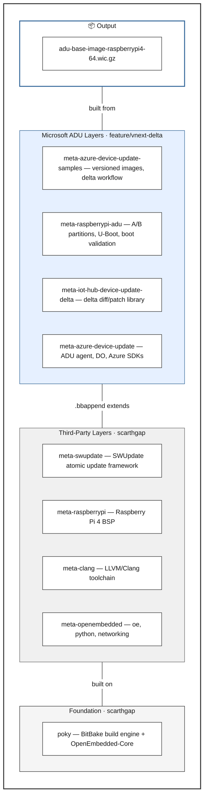
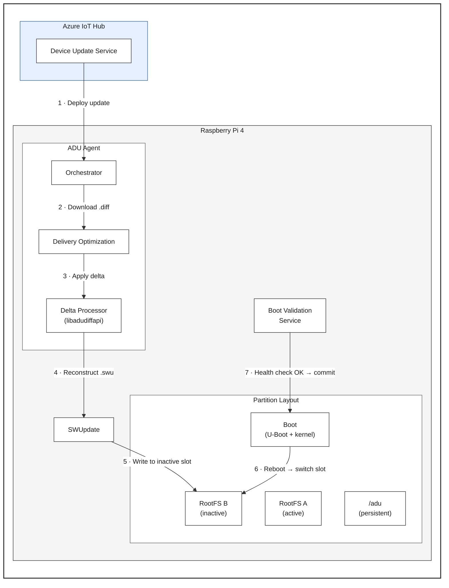

# Yocto Build System — Quick Guide

> **Audience:** ADU development team · **Format:** Slide-style knowledge transfer

---

## 1 · What is Yocto?

A build framework for creating **custom Linux distributions** for embedded
devices. You describe _what_ goes into your OS; Yocto builds it from source.

| Concept | One-liner |
|---------|-----------|
| **BitBake** | The build engine — like `make` for entire Linux distros |
| **Recipe** (`.bb`) | Instructions to fetch, compile, and package one component |
| **Layer** (`meta-*`) | A directory of related recipes, grouped by purpose |
| **Image** | The final output — a flashable Linux filesystem |

🔗 [Yocto Project Quick Build](https://docs.yoctoproject.org/brief-yoctoprojectqs/index.html) ·
[Software Overview](https://www.yoctoproject.org/software-overview/)

---

## 2 · The Layer Model

Layers **stack** on top of each other. Upper layers can extend or override
recipes from lower layers using `.bbappend` files.



> **Reading the stack:** Upper layers extend and override lower layers via
> `.bbappend` files. The foundation (`poky`) provides BitBake and the core
> recipes; everything else stacks on top.

### Recipes & `.bbappend`

| File type | Example | What it does |
|-----------|---------|-------------|
| `.bb` (recipe) | `azure-device-update_git.bb` | Defines how to build the ADU agent from source |
| `.bbappend` (extension) | `e2fsprogs_1.47.0.bbappend` | Patches e2fsprogs in OE-Core to add delta support |
| `.inc` (include) | `adu-update-image-common.inc` | Shared config reused across multiple image recipes |

🔗 [Yocto Mega Manual — Layers](https://docs.yoctoproject.org/dev/dev-manual/layers.html)

---

## 3 · Why Raspberry Pi 4?

| Reason | Detail |
|--------|--------|
| **Accessible** | Cheap, widely available, familiar to developers |
| **Representative** | ARM Cortex-A72 — same family as NXP i.MX8, TI Jacinto 7, Qualcomm Snapdragon |
| **Complete BSP** | Mature `meta-raspberrypi` layer with U-Boot support |

> ⚠️ This is a **reference implementation** for learning and testing.
> Production devices require security hardening, industrial storage, and
> platform-specific bootloader work.

🔗 [RPi4 Specs](https://www.raspberrypi.com/products/raspberry-pi-4-model-b/specifications/)

---

## 4 · Our Reference Image

The `adu-base-image` built by this repo produces a flashable Raspberry Pi 4
image with:

- **A/B dual-partition rootfs** — safe OTA with automatic rollback
- **ADU agent** — cloud-orchestrated updates via Azure IoT Hub
- **SWUpdate** — atomic image installation
- **Delta update support** — 40%+ bandwidth reduction
- **Delivery Optimization** — efficient downloads

### Build it

```sh
# 1. Clone and setup
git clone https://github.com/Azure/iot-hub-device-update-yocto \
    -b feature/vnext-delta ~/adu_yocto/iot-hub-device-update-yocto
cd ~/adu_yocto/iot-hub-device-update-yocto
./scripts/setup.sh

# 2. Install host dependencies
sudo ./scripts/install-deps.sh

# 3. Generate SWUpdate signing key (required)
# See keys/README.md

# 4. Build
./scripts/build.sh -c -t Debug -o ~/yocto_build_dir
```

### Output

```
~/yocto_build_dir/tmp/deploy/images/raspberrypi4-64/
├── adu-base-image-raspberrypi4-64.wic.gz   # Flashable SD card image
├── adu-update-image-v1-*.swu               # Full update package
├── adu-delta-v1-to-v2.diff                 # Delta patch (v1→v2)
└── adu-base-image-*.spdx.tar.zst           # SBOM
```

---

## 5 · Microsoft Layers — Breakdown

All Microsoft layers use **branch `feature/vnext-delta`**.

### 5.1 · meta-azure-device-update

> **Owner:** Microsoft · **Role:** Core ADU agent and Azure infrastructure

| Recipe | What it provides |
|--------|-----------------|
| `azure-device-update` | ADU agent binary — orchestrates updates, talks to IoT Hub |
| `deliveryoptimization-agent` | DO download agent (P2P-capable) |
| `deliveryoptimization-sdk` | DO SDK libraries |
| `azure-iot-sdk-c` | Azure IoT Hub C SDK |
| `azure-sdk-for-cpp` | Azure C++ SDK |
| `adu-agent-service` | systemd service — starts ADU agent at boot |
| `adu-config-setup` | Creates `/adu/` directory structure |
| `adu-persistence-symlinks` | Symlinks `/var/lib/adu/*` → `/adu/data/*` for A/B survival |
| `adu-pub-key` | RSA public key for update package verification |
| `adu-device-info-files` | Manufacturer, model, version identity files |

**Key config variables:**

```
ADU_SOFTWARE_VERSION ?= "0.0.0.1"
MANUFACTURER ?= "Contoso"
MODEL ?= "ADU Raspberry Pi Example"
```

🔗 [README](https://github.com/Azure/meta-azure-device-update/blob/feature/vnext-delta/README.md)

---

### 5.2 · meta-iot-hub-device-update-delta

> **Owner:** Microsoft · **Role:** Binary delta processing library and tools

| Recipe | What it provides |
|--------|-----------------|
| `iot-hub-device-update-delta-processor` | `libadudiffapi.so` — target-side delta apply library |
| `iot-hub-device-update-delta-processor-native` | Same library for the build host (delta generation) |
| `iot-hub-device-update-delta-diffgentool-native` | `diffgentool` — creates `.diff` files from two `.swu` images |
| `bsdiff` | Binary diff algorithm dependency |

**What the `.bbappend` files customize:**

| Modified recipe | Change | Why |
|----------------|--------|-----|
| `e2fsprogs` | Adds `ext2fs_file_get_current_physblock()` | Enables ext4 block-level delta |
| `jsoncpp` | Disables static libs | Avoids link conflicts |
| `libconfig` | Enables native build | Needed by diffgentool on host |

**Key config:**

```
WITH_FEATURE_DELTA_UPDATE ?= "1"    # Toggle delta support
```

🔗 [README](https://github.com/Azure/meta-iot-hub-device-update-delta/blob/feature/vnext-delta/README.md)

---

### 5.3 · meta-raspberrypi-adu

> **Owner:** Microsoft · **Role:** Raspberry Pi 4 A/B update reference

This is the **integration layer** — ties ADU, SWUpdate, and U-Boot together
for a working A/B partition update system.

| Recipe | What it provides |
|--------|-----------------|
| `yocto-a-b-update` | Shell script that handles partition switching after SWUpdate |
| `adu-boot-validation` | systemd service — verifies boot health, triggers rollback on failure |
| `rpi-u-boot-scr` | U-Boot boot script with A/B slot selection and boot counter |
| `azure-device-update` (`.bbappend`) | RPi-specific ADU config, removes .NET dependency |
| WKS files | Partition layout: boot + rootfs_a + rootfs_b |

**A/B update customizations:**

| Customization | Purpose |
|--------------|---------|
| Dual rootfs partitions (WKS) | Two identical slots for safe switching |
| U-Boot `boot_partition` / `boot_attempts` | Slot selection and rollback counter |
| `adu-boot-validation.service` (5 min timeout) | Confirms new partition is healthy |
| `/adu/` persistent partition | Config and state survive rootfs updates |
| Symlinks (`/var/lib/adu/` → `/adu/data/`) | Agent data persists across A/B swaps |

🔗 [README](https://github.com/Azure/meta-raspberrypi-adu/blob/feature/vnext-delta/README.md) ·
[A/B Architecture Guide](https://github.com/Azure/meta-raspberrypi-adu/blob/feature/vnext-delta/ADU-AB-UPDATE-ARCHITECTURE-GUIDE.md) ·
[Porting Guide](https://github.com/Azure/meta-raspberrypi-adu/blob/feature/vnext-delta/PORTING-GUIDE.md)

---

### 5.4 · meta-azure-device-update-samples

> **Owner:** Microsoft · **Role:** Versioned images and automated delta workflow

| Recipe | What it provides |
|--------|-----------------|
| `adu-update-image-v1` | Baseline image (v1.0.0.1) |
| `adu-update-image-v2` | Update target (v2.0.0.1) |
| `adu-update-image-v3` | Update target (v3.0.0.1) |
| `adu-delta-image` | Orchestrates delta generation: v1→v2, v2→v3, v1→v3 |
| `adu-delta-test-package` | Test payload for end-to-end validation |

**Delta generation flow:**

```
Build v1 (.swu) ──┐
                   ├── diffgentool ──→ v1-to-v2.diff
Build v2 (.swu) ──┤
                   ├── diffgentool ──→ v2-to-v3.diff
Build v3 (.swu) ──┘
                   └── diffgentool ──→ v1-to-v3.diff (skip upgrade)
```

🔗 [README](https://github.com/Azure/meta-azure-device-update-samples/blob/feature/vnext-delta/README.md)

---

## 6 · A/B + Delta — How They Work Together



**If health check fails** → U-Boot increments `boot_attempts` → after
threshold, auto-rollback to previous slot.

---

## 7 · Branch Strategy

| Layer type | Branch | Release cadence |
|-----------|--------|----------------|
| Microsoft ADU layers | `feature/vnext-delta` | Tracks ADU agent `1.3.0-rc1` |
| Third-party layers | `scarthgap` | Yocto LTS (latest stable) |
| `meta-clang` | `scarthgap` @ pinned commit | Pinned for reproducibility |

---

## 8 · Further Reading

| Topic | Link |
|-------|------|
| Yocto Quick Build | [docs.yoctoproject.org](https://docs.yoctoproject.org/brief-yoctoprojectqs/index.html) |
| Yocto Mega Manual | [docs.yoctoproject.org](https://docs.yoctoproject.org/dev/) |
| ADU Agent Source | [github.com/Azure/iot-hub-device-update](https://github.com/Azure/iot-hub-device-update/tree/feature/vnext-delta) |
| Azure Device Update Docs | [learn.microsoft.com](https://learn.microsoft.com/azure/iot-hub-device-update/) |
| SWUpdate | [sbabic.github.io/swupdate](https://sbabic.github.io/swupdate/) |
| A/B Architecture Guide | [meta-raspberrypi-adu](https://github.com/Azure/meta-raspberrypi-adu/blob/feature/vnext-delta/ADU-AB-UPDATE-ARCHITECTURE-GUIDE.md) |
| Porting to Custom Hardware | [meta-raspberrypi-adu](https://github.com/Azure/meta-raspberrypi-adu/blob/feature/vnext-delta/PORTING-GUIDE.md) |
